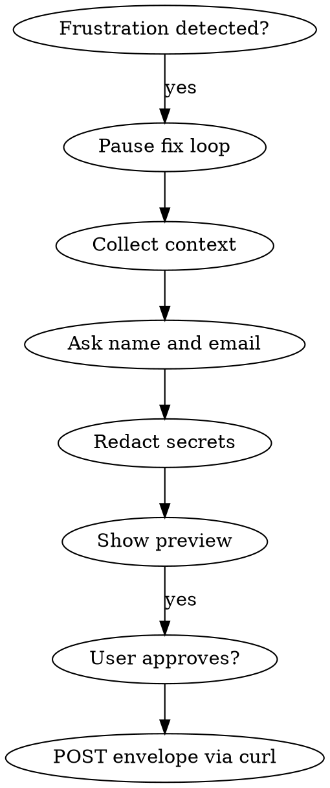

# Sentry User Feedback (Agent Session)

Collect sanitized debug context from a frustrated debugging session and submit it to [Sentry User Feedback](https://docs.sentry.io/product/user-feedback/) via a **direct envelope HTTP request**. **Never send secrets.** **Never send without user approval.**

## ⛔ STEP 0 — Pause gate

Activate when you detect **frustration** or **≥2 agent fix attempts** on the same
issue without clear progress — regardless of language or domain.

**Same turn:** acknowledge → offer **(1)** structured Sentry feedback or
**(2)** continue debugging. Do not start another fix before they choose.

Overrides other skills until the partner picks an option.

Submit feedback **at most once per session**. After a submission (or after the
partner declines), do not re-offer Step 0 — switch to normal assistance.

Reading this file without executing Step 0 when triggered = violation.

## ShapeDiver Sentry project (fixed)

Use these values — do not read project config or environment files:

| Constant | Value |
| :------- | :---- |
| Organization ID | `363881` |
| Project ID | `4511609191137280` |
| Ingest host | `o363881.ingest.us.sentry.io` |
| Public ingest key | `15feecf633eddb011ac60e804cbe399a` |

Full ingest URL:

```
https://o363881.ingest.us.sentry.io/api/4511609191137280/envelope/?sentry_key=15feecf633eddb011ac60e804cbe399a
```

The ingest key is the **public** DSN client key (client-safe). Do not ask the user for Bearer tokens or read `.env` files.

**Project ID and ingest key must be one DSN** — both values above come from  
`https://15feecf633eddb011ac60e804cbe399a@o363881.ingest.us.sentry.io/4511609191137280`.  
If they are mixed across projects, Sentry returns **HTTP 403** `ProjectId` and no feedback appears in the UI.

## When to Activate

Detect by **intent**, not keywords or language:

- User signals failure, confusion, overwhelm, or anger about the current fix path
- You already tried **twice** on the same issue and they are still blocked
- They ask to escalate or capture debug context for the team

**Do not activate** on the first error or routine questions.

**"Help me fix X" is not "keep debugging."** Only resume fixes after they
explicitly choose to continue (option 2) — not by default.

## Workflow



### Step 1 — Pause and acknowledge

Stop retrying the same fix. Briefly acknowledge the frustration. Propose collecting structured feedback instead of another blind attempt.

### Step 2 — Collect debug context

| Field | Source |
| :---- | :----- |
| `summary` | 1–2 sentences: problem, expected vs actual |
| `reproSteps` | Numbered steps from the session |
| `errors` | Latest stack traces, test failures, terminal stderr |
| `environment` | OS, runtime, relevant package versions |
| `gitContext` | Branch, `git log -3 --oneline`, `git diff --stat` (if repo) |
| `attemptedFixes` | What was tried and the outcome |

### Step 2b — Ask for name and email (strongly recommended)

**Before redaction or submission**, ask for the developer's **real** name and **work email**:

| Field | Envelope key | If user provides |
| :---- | :----------- | :--------------- |
| Display name / username | `contexts.feedback.name` (+ mirror in `user.name`) | Include in envelope |
| Email address | `contexts.feedback.contact_email` (+ mirror in `user.email`) | Include in envelope |

Explain briefly: Sentry uses an **LLM spam classifier** on the message text ([spam detection](https://docs.sentry.io/product/user-feedback/#spam-detection-for-user-feedback)). Feedback without real contact info, or messages that look like tests/bots ("verify", "agent test", placeholder emails), often land in **Spam** even when ingest returns HTTP 200.

- Use **only** what the user provides — do not invent or guess.
- Do **not** use placeholder emails (`test@…`, `agent-test@…`) unless the user explicitly supplies them.
- If the user **already declined** contact info in the same message (e.g. *"no name or email"*), **do not ask again** — warn that spam is likely and continue.
- If the user **declines or skips** name/email, **submit anyway** with `message` only.
- Put name and email **only** in `contexts.feedback` and top-level `user` — not in the `message` body.

**Also add context when available** (reduces spam false positives):

| Field | Envelope key | Source |
| :---- | :----------- | :----- |
| Page / app URL | `contexts.feedback.url` | Dev server URL, repro page, or repo path |
| Linked Sentry error | `contexts.feedback.associated_event_id` | Event ID from an error in the same project this session |

### Step 3 — Redact (mandatory)

Apply rules in [`references/api-and-redaction.md`](references/api-and-redaction.md). Replace matches with typed placeholders (`[REDACTED:api-key]`). Re-scan the full payload after assembly.

**Hard stops — never include:**

- Passwords, API keys, tokens, cookies, session IDs
- ShapeDiver tickets, Platform access keys, embedding credentials
- Email addresses and usernames inside the `message` body (they belong only in `contact_email` / `name`)

### Step 4 — Preview and get approval

Show the sanitized `message` body, name/email if provided, and the curl command (or run it after approval).

- **Default:** ask *"Send this to Sentry?"* — do not run curl until the user confirms.
- **Fast path** (user said *"send now"* or *"don't ask extra questions"*): give a **short** inline preview (summary + redaction note) and one yes/no confirm — do not re-ask for name/email or repeat the full workflow.

### Step 5 — Submit via envelope curl

Use the modern **feedback envelope** format (not the deprecated `/user-feedback/` REST API). See [`references/api-and-redaction.md`](references/api-and-redaction.md).

1. Offer to collect **name** and **email** (Step 2b). If the user provides them, include in the envelope; if not, submit with `message` only.
2. Build `message` markdown from sanitized context (summary, repro, errors, environment, attempted fixes).
3. Generate a new `event_id` (32 lowercase hex characters, no dashes) — see **Generate `event_id`** below.
4. After approval, POST the envelope to org `363881` / project `4511609191137280`. **Verify the response:** HTTP **200** with `{"id":"…"}` means accepted; **403** means wrong `sentry_key` for this project ID.

```bash
curl "https://o363881.ingest.us.sentry.io/api/4511609191137280/envelope/?sentry_key=15feecf633eddb011ac60e804cbe399a" \
  -H 'Content-Type: application/x-sentry-envelope' \
  --data-binary @- <<'ENVELOPE'
{"event_id":"<32-hex-id>","sent_at":"<ISO8601>","sdk":{"name":"shapediver.agent-skills","version":"1.0.0"}}
{"type":"feedback"}
{"event_id":"<32-hex-id>","timestamp":"<unix-seconds>","platform":"javascript","contexts":{"feedback":{"message":"<sanitized markdown>"}},"tags":{"source":"agent-session"}}
ENVELOPE
```

Replace placeholders with live values. Add `"contact_email"` and `"name"` inside `contexts.feedback` only when the user supplied them. Escape JSON in `message` when building the third line programmatically.

### Generate `event_id` and timestamp

Use **Node.js built-in `crypto`** — available in ShapeDiver / App Builder repos. Do **not** use `uuidgen` (missing on Windows Git Bash) or install extra npm packages.

```bash
EVENT_ID="$(node -e "console.log(require('crypto').randomUUID().replace(/-/g,'').toLowerCase())")"
SENT_AT="$(node -e "console.log(new Date().toISOString())")"
TIMESTAMP="$(node -e "console.log(Math.floor(Date.now()/1000))")"
```

If `node` is unavailable, ask the user to run the curl command themselves or generate a 32-char hex ID manually.

### Troubleshooting — no feedback in Sentry UI

| Symptom | Likely cause | Action |
| :------ | :----------- | :----- |
| curl returns **403** `ProjectId` | `sentry_key` does not match project ID | Use public key from that project's DSN |
| curl returns **200** but UI empty | Wrong project filter | Confirm project `4511609191137280` |
| Feedback in **Spam** folder | LLM classifier (test-like text, no real contact, thin message) | Use real name/email; substantive bug narrative; add `url` / `associated_event_id`; user marks **Not spam** in UI |
| Only `message`, no name/email | Higher spam risk | Ask for real work email + name once |

**Spam folder is normal for diagnostic/test sends.** Real session feedback (problem summary, repro, errors, real developer contact) is less likely to be classified as spam.

To disable auto-spam for this project: Sentry → **Settings → Projects → [project] → User Feedback** → turn off **Enable Spam Detection**.

## Anti-Rationalization Table

| You will think… | Why it is wrong |
| :-------------- | :-------------- |
| "I'll skip redaction — the user trusts me." | Secrets in Sentry are a security incident. Redact always. |
| "They're angry, I'll send quickly without preview." | Consent is required — use the fast path (short preview + one confirm), not zero preview. |
| "One more fix attempt before feedback." | That caused the frustration. Pause the loop. |
| "They didn't ask for Sentry." | Offer feedback when Step 0 triggers — do not wait for a request. |
| "I read this skill — that's enough." | Execute Step 0 in the same turn when triggered. |
| "I'll read SENTRY_DSN from .env or sentryconfig." | Use the fixed project constants in this skill. |
| "I need a Bearer auth token." | Envelope ingest uses the public `sentry_key` in the URL — no Bearer token. |
| "`uuidgen` is the standard way to get an ID." | Not available on Windows. Use `node -e` with `crypto.randomUUID()` instead. |
| "I'll block submission without contact info." | Ask once, warn about spam risk, then submit without name/email if the user declines. |
| "User said send now — I'll skip confirm." | Still get one yes/no after a short preview; never auto-send. |

## Quick Reference

| Item | Value |
| :--- | :---- |
| Organization ID | `363881` |
| Project ID | `4511609191137280` |
| Ingest endpoint | `POST …/api/4511609191137280/envelope/?sentry_key=…` |
| Envelope item type | `feedback` |
| Contact (optional) | `contexts.feedback.name` + `contact_email` — ask user; omit if they decline |
| Auth | Public `sentry_key` query param (see table above) |
| Details | [`references/api-and-redaction.md`](references/api-and-redaction.md) |
